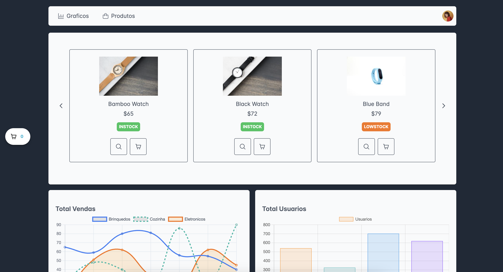

# Loja Style

Um WebApp para venda de produtos, com uma interface intuitiva e funcional. Inclui um dashboard simples que oferece uma lista de produtos, permitindo aos usuários adicionar itens ao carrinho, removê-los e visualizar gráficos informativos.

## Funcionalidades

- **Dashboard Simples:**
  - Lista de produtos disponíveis para compra.
  - Opções para adicionar/remover produtos do carrinho.
  - Gráficos informativos para uma análise visual dos dados.



## Tecnologias utilizadas

 - React 
 - TypeScript
 - TailwindCSS
 - Prime React
 - Firebase

## Dashboard

## Instalação
Após clonar o projeto localmente e estar na pasta do projeto no terminal faça os seguintes comandos em ordem:


```js
    - $ npm install
    - $ npm run start
```

## Deploy

Caso queira ver o projeto deployado [clique aqui](https://dashboard-5872b.web.app/).

